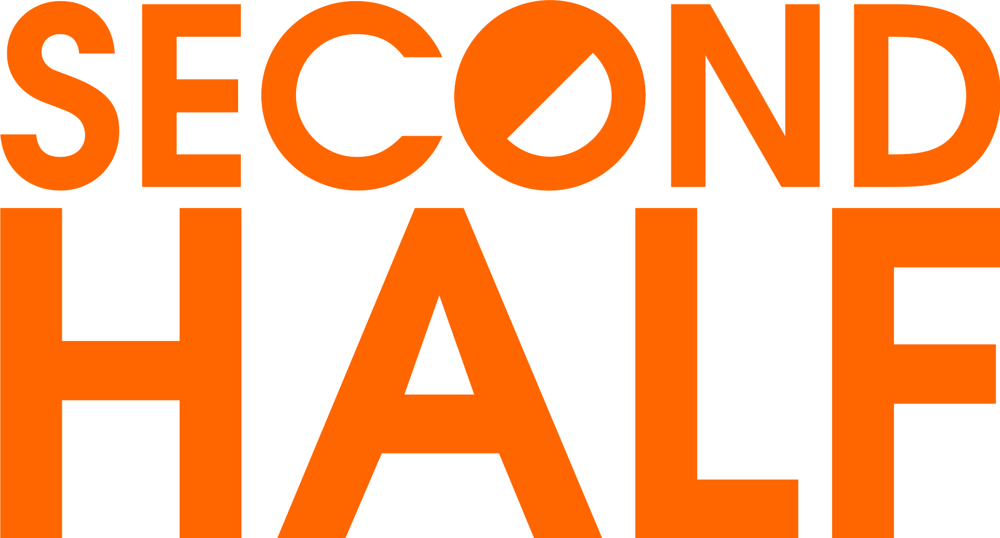

_Open source real-time rendering with Rust_

Renderling is an innovative, GPU-driven real-time renderer designed for efficient scene rendering 
with a focus on leveraging GPU capabilities for nearly all rendering operations. 

Utilizing Rust for shader development, it ensures memory safety and cross-platform compatibility, 
including web platforms. 

The project, currently in the alpha stage, aims for rapid loading of GLTF files and handling large, 
animated scenes with many lighting effects. Development emphasises performance, safety, observability, 
and the use of modern rendering techniques like forward+ rendering and physically based shading.

# Sponsors 

## NLnet 

This project is funded through [NGI Zero Core](https://nlnet.nl/core), a fund established by [NLnet](https://nlnet.nl) 
with financial support from the European Commission's [Next Generation Internet](https://ngi.eu) program. 

Learn more about NLnet's sponsorship at renderling's [NLnet project page](https://nlnet.nl/project/Renderling).

 

## Second Half Games

This project is sponsored by a monthly donation from Second Half Games.

